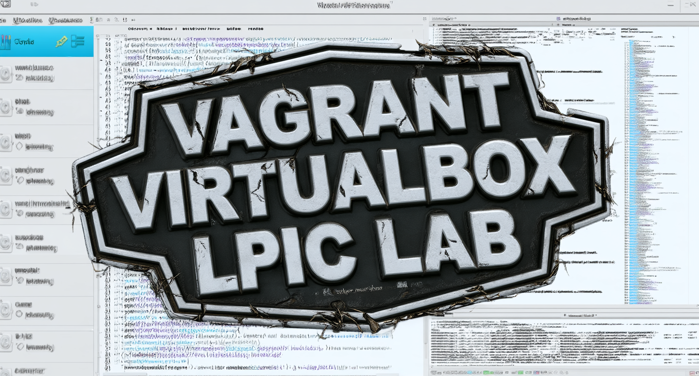
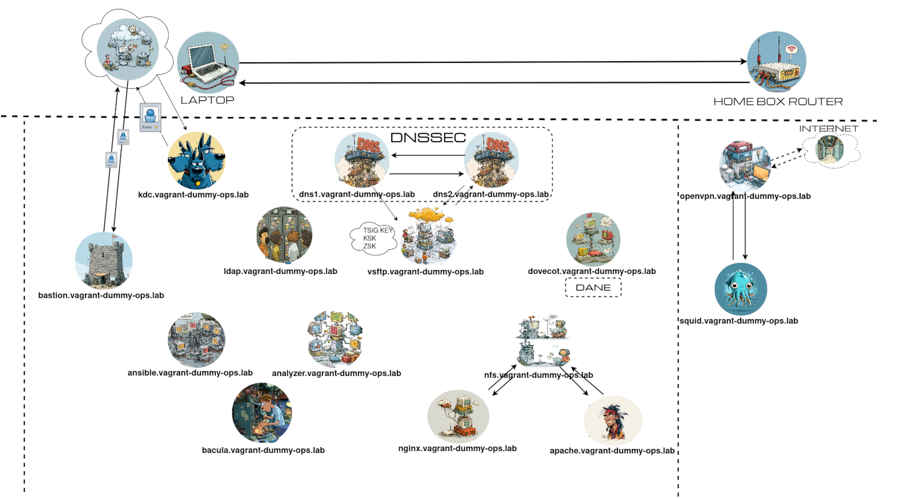

# What is it ?

  A ready to run Dummy Linux Homelab on VirtualBox, using Vagrant.
  Only Debian12 hosts. Other host operating systems may work, but are not currently tested.
  **Learning purposes.**

# Host requirements

The project is currently developed and tested on a 16GB ram RHEL Linux.

The Vagrantfile uses Ruby to loop over a vars/machines.yml where virtual machines to be deployed are defined.

Currently using a default debian box. I do not effectively resize root disk.

## Prerequisites

The following software is required on the host:

| Software | Tested version |
|---|---|
| Vagrant | 2.3.4 |
| VirtualBox | 7.0.24 |
| Ansible | 2.16.14 |
| rsync | 3.4.1 |
| OpenSSH | 9.6p1 |
| Git | 2.49.0 |

## Virtual Machines

| Hostname | Role / Service |
|---|---|
| `vsftp` | Very Secure FTP / infrastructure |
| `dns1` | Primary DNS |
| `dns2` | Secondary DNS |
| `nas-san` | Network Attached Storage |
| `kdc` | Kerberos / KDC |
| `ansible` | Ansible |
| `maven` | Maven |
| `tomcat` | Apache Tomcat |
| `dovecot` | Dovecot |
| `squid` | Squid proxy |
| `openldap` | OpenLDAP |
| `apache` | Apache HTTP server |
| `nginx` | Nginx HTTP server |
| `openvpn` | OpenVPN |
| `bastion` | Bastion / jump host |
| `bacula` | Bacula backup |
| `analyzer` | Analyzer |

# Vagrant Infrastructure Lab

Vagrant project providing a multi-VM infrastructure lab based on **Debian 12**.

Each VM has a specific role/service and is provisioned using **Vagrant, shell scripts and Ansible**.

Shell scripts and much of the ansible roles are poor : not an active working project. It already did the job.

This aim was to be able to quickly manipulate, set/(re)configure, observe, repeat, understand, various infra technologies in order to validate LPIC certifications.

I first ensured a Vagrantfile would deploy straight forward my needs, without "any" ruby commands. Then i asked for a refactor to ChatGPT 5.6, and i adapt/split the resulting ~2000 lines Vagrantfile.

This is not intended to be a "real Vagrant project", a "real prod environment ready to be deployed and maintained with one button click", etc.

Right now the vagrant shell provisioners need to be transformed into ansible roles.

# How use it

Touch a .env file with something like this :

    ANSIBLE_NOCOWS=1
    ANSIBLE_VAULT_SECRET=pine@pplepie94
    APACHE_PASSWORD_ACCESS=Lem@npie94
    DEBIAN_VERSION=debian/bookworm64
    DEVOPS_GROUP_NAME=devops
    DNS_MANAGER_USER_NAME=dns_manager
    DNS_MANAGER_USER_PASSWORD=applepie94
    KDC_ADMIN_NAME=admin
    KDC_ADMIN_PASSWORD=gr@pes03
    LUKS_PASSPHRASE=Str@wberrypie97
    NAS_APACHE_USER_NAME=apache_user
    NAS_APACHE_GROUP_NAME=nas_apache
    NAS_KDC_USER_NAME=kdc_user
    NAS_KDC_GROUP_NAME=nas_kdc
    NAS_OPENLDAP_USER_NAME=openldap_user
    NAS_OPENLDAP_GROUP_NAME=nas_openldap
    NAS_TOMCAT_USER_NAME=tomcat_user
    NAS_TOMCAT_GROUP_NAME=nas_tomcat
    OPENLDAP_ADMIN_PASSWORD=Str@wberrypie
    OPENVPN_SERVER_PASSPHRASE=sug@rpie94
    ROOT_PASSWORD=sn@ils94
    SQUID_PASSWORD=chocol@tepie94
    VAGRANT_ANSIBLE_CA_PASSPHRASE=pe@chpie94
    VAGRANT_ANSIBLE_PASSPHRASE=r@spberrypie94
    VAGRANT_CA_PASSWORD=Lem@npie94
    VAGRANT_TOMCAT_KEYSTORE_PASSWORD=Or@ngepie94

Touch a ./ansible/.ansible.secret file with this (the ANSIBLE_VAULT_SECRET value defined in the .env):

    pine@pplepie94

Execute the startup script

    $ ./create_vagrant_project.sh

Then once started, i suggest to look at ./pocs to see various commands specially the \@start.poc).

Start the Vagrant stack (the 'vagrant up' may have to be run more than once ..,)

    $ vagrant up

Check Vagrant virtual machines stack status

    $ vagrant status

Stop the Vagrant stack

    $ vagrant halt

Check Vagrant ssh config (e.g. for analyzer host)

    $ vagrant ssh-config analyzer

Destroy the project

    $ ./destroy_vagrant_project.sh

# About where it's at

When the vagrant stack is already created and you want to restart it, follow the pocs/@start.poc

The current usage of shell provisioners introduce confusions, inconsistencies : ENV vars usage in Vagrantfile (plain text secrets), forced order combination of the vars/machines.ym, ansible site.yml and inventory files.

A dummy current situation is that the tomcat shell provisioner needs a mount from nas-san host, while it also requires stunnel, which is deployed by an Ansible provisioner executed after the shell provisioner. NB: moreover, the tomcat playbook, deployment, has to be updated since maven will be use.

Ansible secrets have to be reviewed (too many and/or not enough accurate). Use secrets for bacula Passwords).

Check, correct, understand, perms in dovecot where users can check their inbox emails.

Set, use, review, ipv6

Hosts tomcat (a simple JSP, waiting for a maven WAR compilation), apache, nginx must serve a dummy single page, using a random background image (implies internet access through squid host).

Same way the apache servives do, set a nginx secured authenticated access.

It seems not possible to resize the defaults Debian box used. We are missing the file system sizing approach.

Windows server and/or client should exist in the lab too. Download evaluation versions and use virtualbox snapshots to make it last.

# Links

  https://developer.hashicorp.com/vagrant/install

  https://developer.hashicorp.com/vagrant/docs/disks/usage

  https://developer.hashicorp.com/vagrant/docs/disks/virtualbox/common-issues

  https://www.microsoft.com/fr-fr/evalcenter